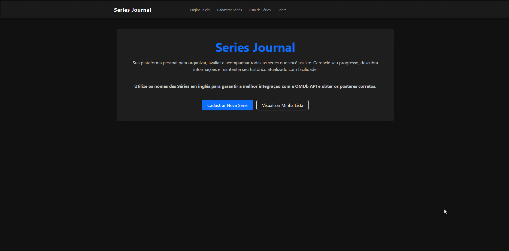
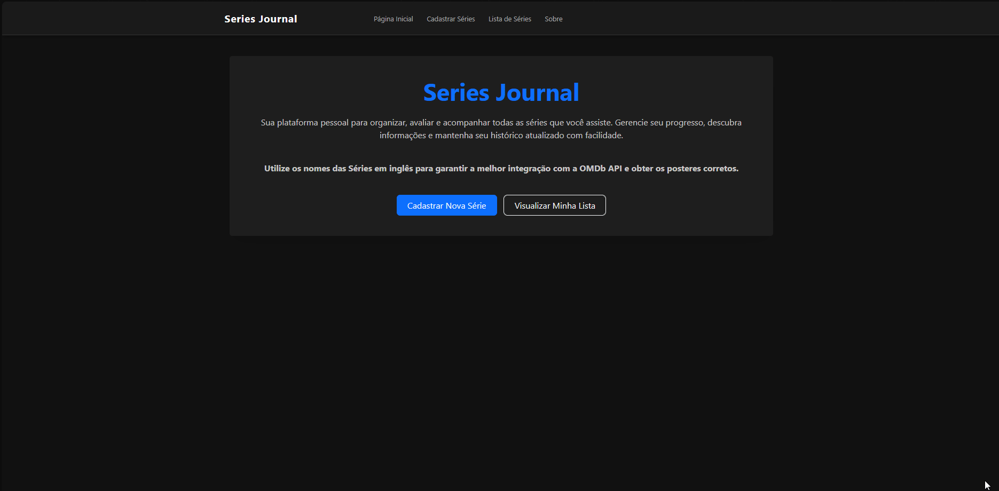

# 📺 Series Journal (Gerenciador de Séries) - Fase 02

Este é um projeto de gerenciamento de séries desenvolvido como parte da **Fase 02** da disciplina de Desenvolvimento Front-End do curso de Análise e Desenvolvimento de Sistemas da PUCRS.

O sistema evoluiu de uma gestão de estado local para uma aplicação robusta que consome uma **API REST** externa, integrando comunicação HTTP assíncrona, busca automática de imagens em APIs públicas, testes automatizados e uma interface totalmente reformulada com Bootstrap.

## ✨ Funcionalidades

* **Integração REST API:** Todo o fluxo de CRUD (Create, Read, Update, Delete) agora é persistido e consumido de um back-end real fornecido pela disciplina.
* **Capa Automática (Integração OMDb API):** Ao renderizar a lista, o sistema busca automaticamente os posteres oficiais das séries baseando-se no título cadastrado, utilizando a OMDb API.
* **Testes Automatizados:** Suíte de testes unitários e de renderização implementada para garantir a confiabilidade dos componentes e das páginas.
* **Interface Responsiva (Dark Mode):** Migração do CSS puro para o ecossistema do Bootstrap, com a criação de um tema escuro customizado (Dark Mode Cinematográfico) para valorizar os posteres.
* **Navegação SPA:** Transição fluida entre as páginas de Cadastro, Lista, Sobre e Home via React Router DOM.
* **Edição In-line:** Edição rápida e prática diretamente na linha da série.

## 📸 Demonstração do Projeto


 


## 🚀 Tecnologias e Ferramentas Utilizadas

* **React & Vite:** Ecossistema principal para construção da interface e build rápido.
* **Axios:** Cliente HTTP baseado em Promises utilizado para realizar as requisições (GET, POST, PUT, DELETE) à API REST.
* **Bootstrap:** Framework de CSS utilizado para componentização rápida (Cards, NavBars, Grid System) e responsividade.
* **Vitest & React Testing Library:** Framework de testes unitários moderno e ágil, configurado com JSDOM para simular o navegador.
* **OMDb API:** API externa pública utilizada para a busca automatizada das capas das séries.

## 🧩 Descrição dos Componentes e Estrutura

A arquitetura foi refatorada para descentralizar o estado e focar no consumo de dados via rede:

* **`services/api.js`**: Arquivo de configuração centralizada do Axios, definindo a URL base de comunicação com a API.
* **`App.jsx`**: Focado exclusivamente no roteamento da aplicação (`Routes`). Deixou de ser a "Fonte da Verdade" dos dados, delegando essa responsabilidade aos componentes que consomem a API.
* **`SerieForm`**: Componente de cadastro que valida os dados localmente e realiza o POST assíncrono para a API, redirecionando o usuário para a lista em caso de sucesso.
* **`SerieList`**: Executa o `useEffect` para buscar a lista do back-end (GET) no momento da montagem e gerencia o filtro de busca em tempo real.
* **`SerieItem`**: Renderiza a linha individual. Agora possui seu próprio ciclo de vida para buscar o poster na OMDb API e emite os comandos HTTP de atualização (PUT) e exclusão (DELETE).
* **`*.test.jsx`**: Arquivos isolados que contêm os testes de renderização e comportamento de cada componente, utilizando *mocks* para simular chamadas de rede.

## 🧠 Decisões de Desenvolvimento (Fase 02)

* **Proxy no Vite (CORS):** Para contornar o erro de CORS ao tentar comunicar o front-end (porta 5173) diretamente com a API local da faculdade (porta 5000), foi configurado um Proxy no `vite.config.js`, permitindo requisições fluidas e seguras.
* **Mocking em Testes:** Nos testes automatizados, o Axios foi "mockado" (simulado). Isso garante que os testes rodem rapidamente e não dependam de conectividade com a internet ou com a API rodando, focando apenas na lógica dos componentes React.
* **Fallback de Imagens:** Caso a OMDb API não encontre a série cadastrada ou a requisição falhe, o `SerieItem` está programado para renderizar uma imagem de *placeholder* genérica, evitando a quebra visual do layout.

## ⚙️ Pré-requisitos e Execução

Para rodar este projeto, você precisará executar dois servidores simultaneamente (O back-end fornecido pela PUCRS e este projeto front-end). Certifique-se de ter o Node.js instalado.

### 1. Executando a API (Back-end)
1. Clone o repositório da disciplina (`adsPucrsOnline/DesenvolvimentoFrontend/`).
2. Navegue até a pasta da API: `cd ./DesenvolvimentoFrontend/serieJournal-api/`
3. Instale as dependências: `npm install`
4. Inicie o servidor: `npm start` *(A API rodará na porta 5000)*.

### 2. Executando o Front-end (Este projeto)
Abra um **novo terminal** na pasta raiz deste projeto React e execute:
1. `npm install` (Para instalar todas as dependências, incluindo Axios e Bootstrap).
2. `npm run dev` (Para iniciar a aplicação).

### 3. Rodando os Testes Automatizados
Com o terminal do front-end aberto, você pode validar a integridade do código rodando:
* `npm run test` (Executa os testes unitários e de renderização).

### 📁 Estrutura Principal da Pasta
```text
src/
├── components/
│   ├── NavBar/
│   │   └── index.jsx             # Componente de navegação superior
│   ├── SerieForm/
│   │   ├── index.jsx             # Formulário de cadastro e validação
│   │   └── index.test.jsx        # Testes do formulário
│   └── SerieList/
│       ├── SerieItem.jsx         # Renderização de linha, edição (PUT), exclusão e API OMDb
│       └── SerieItem.test.jsx    # Testes unitários do item
├── pages/
│   ├── About.jsx & .test.jsx     # Página Sobre e seus testes
│   ├── Cadastro.jsx              # Página que abriga o formulário
│   ├── Home.jsx & .test.jsx      # Página inicial de boas-vindas
│   └── List.jsx & .test.jsx      # Página de listagem com filtro
├── services/
│   └── api.js                    # Configuração global do Axios
├── App.css / index.css           # Estilização global e Dark Mode
├── App.jsx                       # Gerenciamento de rotas (React Router DOM)
└── main.jsx                      # Ponto de entrada (Entry point) da aplicação